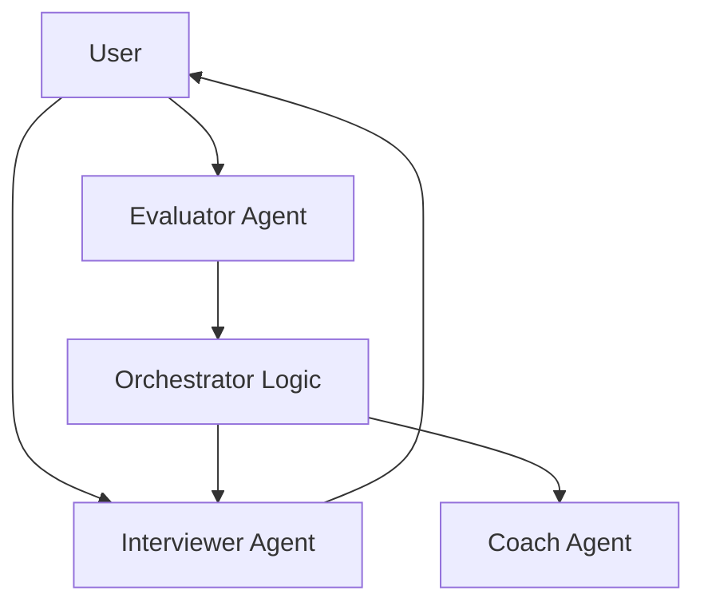

# AI Mock Interview Coach
**Live Demo:** https://your-app.streamlit.app

A multi-agent AI system that simulates realistic mock interviews and provides structured, actionable feedback to help candidates improve.

---

## Overview

This project implements an adaptive mock interview system using a multi-agent architecture.
It dynamically adjusts questioning based on candidate responses and generates detailed coaching feedback at the end.

The system is designed to handle real-world interview scenarios such as:

* Vague or incomplete answers
* Incorrect reasoning
* Strong answers requiring deeper probing
* “I don’t know” responses

---

## Architecture

The system operates as a controlled conversational loop:



### Components

**Interviewer Agent**
Conducts the interview, adapts question difficulty, and handles real-world conversational behavior.

**Evaluator Agent**
Analyzes responses across multiple dimensions (clarity, depth, structure, conciseness) and produces structured JSON output used for control flow.

**Coach Agent**
Synthesizes the entire interview into pattern-based feedback and actionable recommendations.

**Orchestrator**
Maintains state and determines the next action (follow-up, new question, or difficulty adjustment).

---

## Key Features

* Multi-agent architecture with clear role separation
* Adaptive questioning based on evaluation signals
* Structured evaluation using JSON outputs
* Pattern-based coaching feedback
* Chat-style UI built with Streamlit
* Robust handling of edge cases and messy inputs

---

## Prompt Engineering

The system relies heavily on constrained prompting to ensure reliability and realism:

* **Token-forced outputs (Coach)**
  Forces responses to start with a strict markdown structure, preventing conversational preambles.

* **Few-shot structured outputs (Evaluator)**
  Includes example JSON to enforce schema consistency across model outputs.

* **Negative constraints (Interviewer)**
  Explicitly prevents behaviors like praising answers ("Great answer") to maintain realistic interview pacing.

* **Edge-case handling**
  Prompts explicitly handle vague answers, incorrect reasoning, and empty responses.

See the `prompts/` directory for full implementations.

---

## Orchestration Logic

After each answer, the system evaluates performance and adjusts behavior:

* Weak answer → targeted follow-up
* Strong answer → increased difficulty
* Very weak answer → simplified question

This creates a dynamic interview experience rather than a fixed question list.

---

## Tech Stack

* Python
* Streamlit
* Groq API (LLM inference)
* python-dotenv

---

## Setup Instructions

### 1. Clone the repository

```bash
git clone <your-repo-url>
cd ai-mock-interviewer
```

---

### 2. Create virtual environment

```bash
python -m venv venv
```

Activate:

* Mac/Linux:

```bash
source venv/bin/activate
```

* Windows (CMD):

```bash
venv\Scripts\activate
```

---

### 3. Install dependencies

```bash
pip install -r requirements.txt
```

---

### 4. Add environment variables

Create a `.env` file in the root directory:

```
GROQ_API_KEY=your_api_key_here
```

---

## Running the Project

### CLI Mode

```bash
python main.py
```

### Streamlit UI

```bash
streamlit run ui/app.py
```

---

## Example Transcripts

The `examples/` directory contains sample interview runs:

* Strong candidate
* Weak candidate
* Edge case (uncertain / incomplete responses)

These demonstrate system behavior, evaluation consistency, and coaching output.

---

## Design Decisions

**State Isolation via Multi-Agent Architecture**
Separating the Evaluator from the Interviewer prevents conversational contamination and enables strict JSON outputs without breaking the natural interview flow.

**Structured Control via JSON Outputs**
The Evaluator produces machine-readable scores that drive deterministic orchestration logic instead of relying on unstructured LLM reasoning.

**Memory-Based Context Tracking**
Conversation history is explicitly stored and passed to maintain coherence and enable follow-up questions.

**Prompt-Constrained Behavior**
Strict instructions and constraints are used to control LLM output format and interaction style.

---

## Tradeoffs

**No Retrieval-Augmented Generation (RAG)**
The system relies purely on LLM knowledge to keep the architecture lightweight and focused on interaction design.

**Model Choice (Groq + Llama 3.1 8B)**
Optimized for low latency and fast interaction, but introduces risks in output reliability.
Mitigated through:

* few-shot prompting
* strict output constraints
* custom JSON parsing

**Evaluation Limitations**
Scoring is heuristic and prompt-driven rather than deterministic, which may introduce variability.

---

## Future Improvements

* Resume-based personalization
* Voice-based interview interface
* Domain-specific question banks
* Improved evaluation calibration
* Real-time scoring visualization

---

## Conclusion

This project demonstrates how LLMs can be orchestrated into a structured, adaptive system rather than used as standalone tools.

The focus is on:

* decision-making
* evaluation
* feedback synthesis

---

## Feedback

Open to suggestions and improvements.
